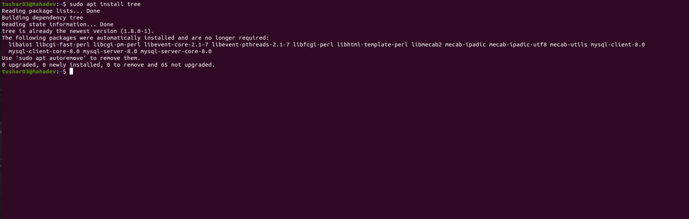
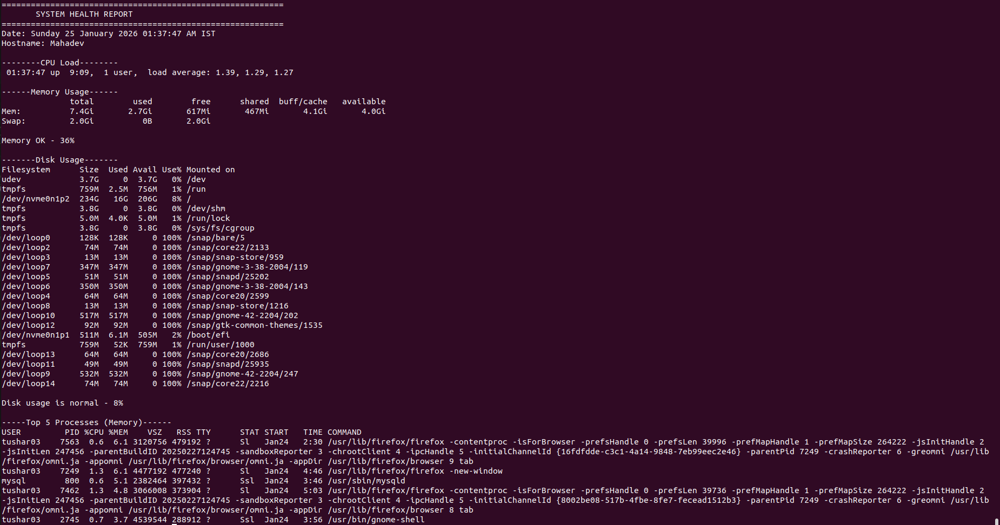
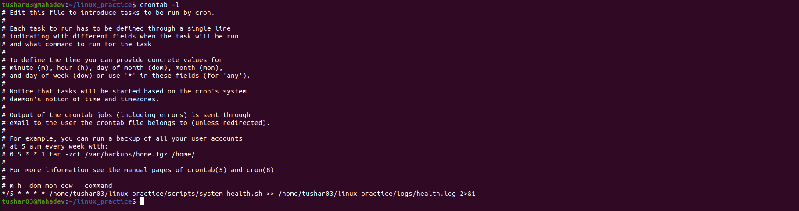

# Linux System Health Monitoring & Automation

A Linux-based system health monitoring project that automates CPU, memory, and disk usage checks using Bash scripting, cron scheduling, and log rotation.  
This project simulates real-world infrastructure monitoring and operational troubleshooting.

---

## 📌 Problem Statement

In production Linux environments, system resource issues such as high memory usage or disk exhaustion can cause service downtime if not monitored proactively.  
Manual checks are error-prone and do not scale.

This project addresses that problem by:
- Automating system health checks
- Scheduling periodic monitoring
- Generating structured logs
- Managing log growth safely

---

## 🧠 Architecture & Workflow

1. A Bash script (system_health.sh) collects system metrics:
   - CPU usage
   - Memory usage
   - Disk usage
2. Thresholds are evaluated during each run
3. Logs are written to a dedicated logs directory
4. The script is scheduled via cron to run automatically
5. logrotate manages log size and compression

---


## 🛠 Technologies Used

- Linux (Ubuntu)
- Bash Scripting
- Cron (Job Scheduling)
- Logrotate (Log Management)
- Git & GitHub (Version Control)

## ⚙️ How to Run the Project

### 1️⃣ Clone the repository
```bash
git clone https://github.com/<tushartiwari03>/linux_practice.git
cd linux_practice


🔁 Replace <your-username> with your actual GitHub username.

---

## ▶️ 5️⃣ How to Execute the Script

md
### 2️⃣ Make the script executable
bash
chmod +x scripts/system_health.sh

### Run Manually
./scripts/system_health.sh


---

## ⏰ 6️⃣ Cron Job Setup

md
---

## ⏰ Cron Job Scheduling

Edit crontab:
bash
crontab -e


*/5 * * * * /home/tushar03/linux_practice/scripts/system_health.sh >> /home/tushar03/linux_practice/logs/health.log


---

## 🗂 7️⃣ Log Rotation

md
---

## 🗂 Log Rotation

Log rotation is handled using logrotate to compress and manage old logs.

Config file:
bash
/etc/logrotate.d/system_health


---

## 📌 8️⃣ What You Learned (VERY IMPORTANT)

```md
---

## 📌 What I Learned

- Linux system monitoring fundamentals
- Bash scripting for automation
- Cron job scheduling
- Log management with logrotate
- Version control using Git and GitHub


---

## 🖼 Project Screenshots

### 📁 Project Structure


### ▶️ Script Execution


### 📊 Health Logs


### ⏰ Cron Job Scheduling


### 🌐 GitHub Repository

